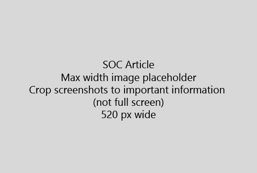

Pradėti jūsų straipsnis yra labai trumpas įvadas (1 sakinys). Pastatykite save skaitytojo vietoje - kodėl jie čia? Ką jie daro?Start your article with a very short introduction (1 sentence). Put yourself in the reader's place - why are they here? What should they do? 
  
1. Gauti tiesiai į trumpą sąrašą veiksmus atlikti užduotį.Get straight to a quick list of steps to accomplish the task.
    
    Jei jums reikia paaiškinti sąvoką, ar jie turi daryti būtina sąlyga žingsniai, pridėkite trumpą informaciją žemiau žingsnis kur reikia, ir [nuorodą](https://support.office.com/article/f37e7984-cf03-4fde-92d3-82970d7e241b.aspx) į koncepcija arba veiksmų.If you need to explain a concept, or they have to do pre-requisite steps, add a quick summary below the step where they need it, and [link](https://support.office.com/article/f37e7984-cf03-4fde-92d3-82970d7e241b.aspx) to the concept or steps. 
    
2. Išlaikyti tvarką trumpas – pageidautina 5 arba mažiau žingsnių, ne daugiau kaip 8.Keep procedures short - preferably 5 or fewer steps, no more than 8.
    
3. Naudoti **Ui stilių** , vartotojo sąsajos elementų arba teksto žmonėms reikės įvesti.Use **Ui style** for user interface elements or for text people need to enter. 
    
4. Naudoti veiksmažodžiai pasirinkti, pasirinkite, arba įvesti kaip veiksmai ir meniu Formatuoti kaip **meniu** \> **komandą**.Use the verbs choose, select, or enter as actions, and format menus as **Menu** \> **Command**.
    
5. Pasirinktinai įtraukite ekrano kontekstui (jei vartotojo sąsaja yra sunku surasti, ar reikia atlikti užduotis).Optionally, add a screenshot for context (if UI is hard to locate, or it's needed to complete the task).
    
    Maksimalus plotis: 520 pikselių. Naudoti standartinę temą, ne parodyti bet kokią asmeninę informaciją ir apkarpyti parodyti tik tai, kas yra svarbu.Maximum width: 520 pixels. Use a standard theme, do not show any personal information, and crop to show only what's relevant. 
    
    
  
Jei norite pridėti vaizdo įrašą arba paveikslėlį, naudokite dviejų stulpelių tinklelį ir žingsnius į kairę ir vaizdo arba ekrano dešinėje - Peržiūrėkite [veiksmus ir video tinklo pavyzdys](https://support.office.com/article/14ce8e82-efa0-47f5-bb84-94f078db3dae.aspx).If you want to add a video or screenshot, use a two-column grid and have the steps in the left and the video or screenshot in the right - see [Steps and video grid example](https://support.office.com/article/14ce8e82-efa0-47f5-bb84-94f078db3dae.aspx). 
  
Taikyti ne daugiau kaip 500 žodžių straipsnį.Target no more than 500 words for an article.
  
# Pavyzdys straipsnioExample article

[Mano nuotraukos keitimasChange my photo](https://support.office.com/article/555376e0-1fca-49ba-8434-307a0525c767.aspx)
  

