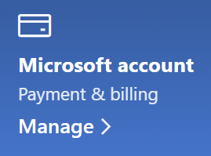

# "Microsoft" paskyros informacijos keitimas

Eikite [https://account.microsoft.com](https://account.microsoft.com/) ir prisijunkite, jei reikia. Taip pereisite į savo paskyros ataskaitų sritį.  

**Redaguoti mano vardą ir asmeninę informaciją**

1. Paskyros ataskaitų srityje šalia paskyros paveikslėlio ir pavadinimo spustelėkite tris taškus (daugiau veiksmų) > Redaguoti profilį**.
2. Puslapyje **Profilio redagavimas** naudokite saitus, kad pakeistų profilio paveikslėlį, vardą, gimimo datą, vietą ir rodymo kalbos nuostatas. Atkreipkite dėmesį į "Xbox" arba "Skype profilių saitus, kuriuose galite pakeisti šių paskyrų išsamią informaciją.

**El. pašto adresų ir telefono numerių valdymas**

"Microsoft" paskyroje yra vienas ar daugiau el. pašto adresų arba telefono numerių, susietų su ja kaip "pseudonimais". Norėdami valdyti šiuos veiksmus:

1. Paskyros ataskaitų srityje šalia paskyros paveikslėlio ir pavadinimo spustelėkite tris taškus (daugiau veiksmų) > **Profilio redagavimas.**
2. Puslapyje **Profilio redagavimas** spustelėkite Valdyti, **kaip prisijungiate prie "Microsoft".** 
3. Matysite paskyros pseudonimų sąrašą ir galėsite valdyti sąrašą, įskaitant el. pašto adresų ir telefono numerių įtraukimą ir naikinimą. Čia taip pat galite pasirinkti, kuriuos pseudonimus galima naudoti prisijungti prie paskyros ir kuris pseudonimas laikomas "pirminiu", kuris bus rodomas jūsų Windows 10 įrenginiuose.

**Mokėjimo būdų valdymas, taip pat atsiskaitymo pavadinimas ir adresas** 

1. Paskyros ataskaitų srityje šalia paskyros paveikslėlio ir pavadinimo spustelėkite tris taškus (daugiau veiksmų) > **Profilio redagavimas.**
2. Dalyje **Mokėjimo & atsiskaitymas** spustelėkite **Valdyti**.

    

3. Čia galite įtraukti, redaguoti ir pašalinti mokėjimo būdus ir jų susijusius atsiskaitymo adresus. 
