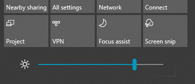

# Ekrano ryškumo keitimas Windows 10

Jei jūsų Windows 10 naujesnė nei 1903 versija, veiksmų centre yra **slankiklis** Ryškumas. Norėdami atidaryti veiksmų centrą,  spustelėkite mygtuką Pranešimas, esantį dešinėje užduočių juostos pusėje, arba **klaviatūroje paspauskite Windows pagrindinis + A.**

Jei jūsų Windows 10 yra ankstesnė versija, ryškumo slankiklį galite rasti nueidami **[į "Parametrai > System > Display](ms-settings:display?activationSource=GetHelp)**" .

**Pastabos:**

- Staliniuose kompiuteriuose, kuriuose yra išorinis monitorius, gali būti nematote įtaisytųjų rodymo slankiklių Ryškumo keitimas. Norėdami pakeisti išorinio monitoriaus ryškumą, naudokite monitoriaus valdiklius.
- Jei neturite stalinio kompiuterio ir slankiklis nerodomas arba neveikia, pabandykite atnaujinti rodymo tvarkyklę. Užduočių juostos ieškos lauke įveskite Įrenginių **tvarkytuvė**, tada **rezultatų** sąraše pasirinkite Įrenginių tvarkytuvė. Įrenginių **tvarkytuvėje** pasirinkite **Rodymo adapteriai**, tada pasirinkite rodymo adapterį. Paspauskite ir laikykite (arba dešiniuoju pelės mygtuku spustelėkite) rodomą adapterio pavadinimą ir spustelėkite **Naujinti tvarkyklę;** tada vykdykite nurodymus.
