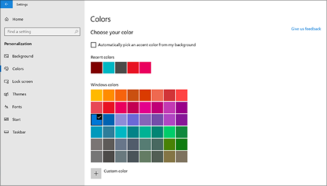
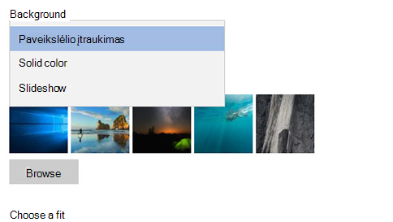

# Darbalaukio fono ir spalvų keitimas

Norėdami pakeisti spalvų parametrus, eikite į parinktį **pradėti**  >  **parametrus**  >  **personalizavimo**  >  **spalvas**, tada pasirinkite savo spalvą arba "Windows", kad "Windows" patraukia paryškintą spalvą iš fono.

Norėdami pakeisti darbalaukio foną, eikite į **paleisties**  >  **parametrų**  >  **tinkinimo**  >  **fonas**, tada pasirinkite paveikslėlį, vientisą spalvą arba sukurkite paveikslėlių skaidrių demonstravimą. 

Norite daugiau darbalaukio fonų ir spalvų? Apsilankykite ["Microsoft" parduotuvėje](https://www.microsoft.com/store/collections/windowsthemes) , kad pasirinktumėte dešimtys nemokamų temų.
