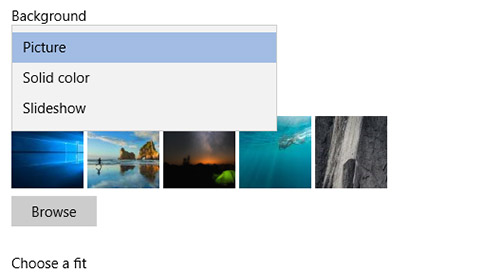

# Darbalaukio fono ir spalvų keitimasChange your desktop background and colors

Norėdami pakeisti spalvų parametrą, eikite į **Pradžia**  >  **Parametrai** Personalizavimo spalvos , tada pasirinkite savo spalvą arba leiskite  >    >  "Windows" ištraukti pagrindinę spalvą iš fono.To change your colors setting, go to **Start** > **Settings** > **Personalization** > **Colors**, and then choose your own color or let Windows pull an accent color from your background.

Norėdami pakeisti darbalaukio foną, eikite **į Pradžia** Parametrai Personalizavimas Fonas , tada pasirinkite paveikslėlį, vientisą spalvą arba  >    >    >  sukurkite paveikslėlių skaidrių demonstravimą.To change your desktop background, go to **Start** > **Settings** > **Personalization** > **Background**, and then choose a picture, solid color, or create a slideshow of pictures. 

Norite daugiau darbalaukio fonų ir spalvų?Want more desktop backgrounds and colors? Apsilankykite ["Microsoft Store"](https://www.microsoft.com/store/collections/windowsthemes) ir pasirinkite iš daugybės nemokamų temų.Visit [Microsoft Store](https://www.microsoft.com/store/collections/windowsthemes) to choose from dozens of free themes.
