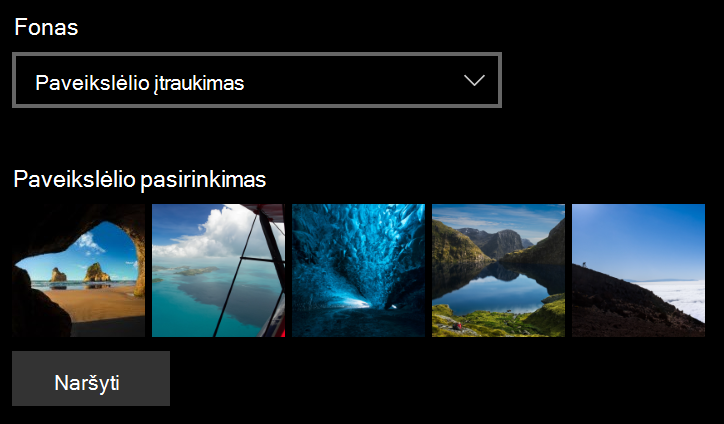

# Užrakto ekrano fono keitimas

- Eikite **į**  >  **Parametrų personalizavimo**  >  **užrakto ekranas**. Arba spustelėkite arba bakstelėkite [čia](ms-settings:lockscreen?activationSource=GetHelp).

- Norėdami nustatyti pasirinktinį fono **paveikslėlį,** išplečiamajame sąraše Fonas pasirinkite Paveikslėlis ir pasirinkite arba  **Pereikite** prie paveikslėlio.

  

- Norėdami nustatyti pasirinktinių paveikslėlių skaidrių  demonstravimą, išplečiamajame sąraše Fonas pasirinkite Skaidrių demonstravimas ir pasirinkite albumą arba įtraukite aplanką, kuriame yra skaidrių demonstravimo paveikslėliai. 

  
