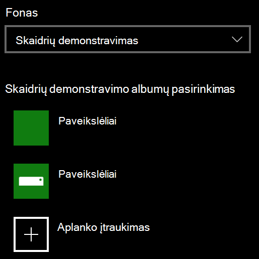

# Užrakto ekrano fono keitimasChange your lock screen background

- Eikite į **parametrų**  >  **personalizavimo**  >  **užrakto ekranas**.Go to **Settings** > **Personalization** > **Lock screen**. Arba spustelėkite arba bakstelėkite [čia](ms-settings:lockscreen?activationSource=GetHelp).Or click or tap [here](ms-settings:lockscreen?activationSource=GetHelp).

- Norėdami nustatyti pasirinktinę fono paveikslėlį, išplečiamajame sąraše **fonas** pasirinkite **paveikslėlis** ir pasirinkite arba **naršykite** į paveikslėlį.To set a custom background picture, select **Picture** from the **Background** drop-down list, and choose or **Browse** to the picture.

  

- Norėdami nustatyti skaidrių demonstraciją su pasirinktiniais paveikslėliais, išplečiamajame sąraše **fonas** pasirinkite **skaidrių demonstravimas** , tada pasirinkite albumą arba įtraukite aplanką, kuriame yra skaidrių demonstravimo paveikslėliai.To set up a slideshow of custom pictures, select **Slideshow** from the **Background** drop-down list, and choose an album or add a folder that contains the pictures for the slideshow.

  
