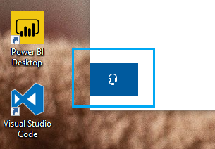

# Susisiekite su mumis spustelėdami ausinių mygtuką

Jei norite susisiekti su "Microsoft" palaikymo tarnyba, spustelėkite **Susisiekite** su mumis apatiniame kairiajame šios programos kampe. Išsiskridusiame lange, pasirinkę produkto ir problemų kategoriją, galėsite vadovautis tinkamu palaikymo kanalu.

Galite toliau bendrauti su likusia programėle net inicijavote seansą Susisiekite su mumis. Skydą Susisiekite su mumis galima laikinai minimizuoti spustelėjus bet kurią programos vietą. Norėdami grįžti į tą patį seansą, tiesiog dar **kartą spustelėkite Susisiekti su** mumis.
