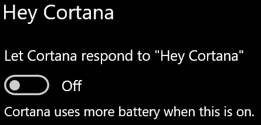

# "Cortana" su manimi nekalba arba manęs negirdiCortana doesn’t talk to me or can’t hear me

Jei bandote naudoti funkciją "Hey Cortana", kuri leidžia kalbėtis su "Cortana" nepasirinkę "Cortana" mygtuką užduočių juostoje arba mikrofono mygtuką "Cortana" skydelyje, patvirtinkite, kad ši funkcija įjungta:If you are trying to use the "Hey Cortana" feature, which allows you to talk to Cortana without selecting the Cortana button on the taskbar or the microphone button in the Cortana panel, confirm that the feature is enabled:

1. Eikite į **Pradžia**, tada pasirinkite **[Parametrai > Cortana](ms-settings:cortana?activationSource=GetHelp)**.Go to **Start**, then select **[Settings > Cortana](ms-settings:cortana?activationSource=GetHelp)**.
2. Dalyje **Hey Cortana**perjunkite **jungiklį Leisti "Cortana" atsakyti į "Hey Cortana"** į **Įjungta**.Under **Hey Cortana**, switch the **Let Cortana respond to "Hey Cortana"** toggle to **On**.

**Ar jūsų privatumo parametrai neleidžia "Cortana" girdėti jūsų?****Are your privacy settings preventing Cortana from hearing you?**

Jūsų privatumo parametrai gali neleisti "Cortana" atsakyti į jūsų balsą.Your privacy settings can prevent Cortana from responding to your voice.
- Patikrinkite, ar įjungtas kalbėjimo atpažinimas internete:Check to make sure Online Speech recognition is turned on:
    - Eikite į **Pradžia**, tada spustelėkite **[Parametrai > Privatumo > kalbėjimas](ms-settings:privacy-speech?activationSource=GetHelp)**.Go to **Start**, then click **[Settings > Privacy > Speech](ms-settings:privacy-speech?activationSource=GetHelp)**.
    - Dalyje **Kalbėjimo atpažinimas tinkle**perjunkite parametrą į **Įjungta**.Under **Online speech recognition**, switch the setting to **On**.
- Patikrinkite, ar "Cortana" turi teisę pasiekti mikrofoną.Check to make sure Cortana has permission to access your microphone. 
    - Eikite į Pradžia, tada spustelėkite **[Parametrai > Privatumo > mikrofonas](ms-settings:privacy-microphone?activationSource=GetHelp)**.Go to Start, then click **[Settings > Privacy > Microphone](ms-settings:privacy-microphone?activationSource=GetHelp)**.
    - Dalyje **Pasirinkite, kurios programėlės gali pasiekti jūsų mikrofoną**, programėlių ir paslaugų sąraše ieškokite **"Cortana"** ir įsitikinkite, kad jungiklis perjungiamas į **Įjungta**.Under **Choose which apps can access your microphone**, look for **Cortana** within the list of apps and services and make sure the switch is toggled to **On**.

Be to, taip pat įsitikinkite, kad jūsų garsiakalbiai ar mikrofonai yra parengti ir veikia, kad galėtumėte pasikalbėti su "Cortana".Moreover, please also make sure that your speakers or microphones are up and working in order to talk to Cortana.
