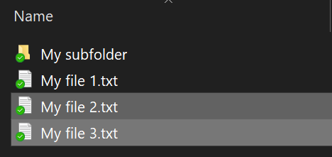
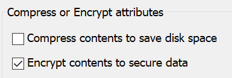

# „Windows 10“ failų arba aplankų šifravimasEncrypt files or folder in Windows 10

Galite užšifruoti visą diską naudodami „BitLocker“, bet norėdami užšifruoti tik pavienius failus arba aplankus (ir jų turinį):You can encrypt an entire disk using BitLocker, but to encrypt only individual files or folders (and their contents):

1. **Failų naršyklėje** pasirinkite failą (-us) / aplanką (-us), kurį (-iuos) norite užšifruoti.In **File Explorer**, select the file(s)/folder(s) you want to encrypt. Šiame pavyzdyje buvo pasirinkti du failai:In this example, two files have been selected:

    

2. Dešiniuoju pelės mygtuku pasirinkite failus, tada spustelėkite **Ypatybės**.Right-click the selected files and click **Properties**.

3. Lange **Ypatybės**, spustelėkite **Išplėstinės**.In the **Properties** window, click **Advanced**.

4. Lange **Išplėstinės ypatybės** pasirinkite žymės langelį **Užšifruoti turinį, kad būtų apsaugoti duomenys**:In the **Advanced Properties** window, select the **Encrypt contents to secure data** checkbox:

    

5. Spustelėkite **Gerai**.Click **OK**.
