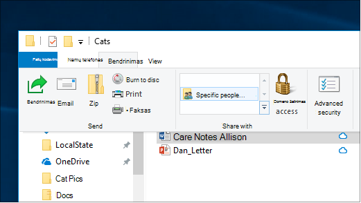
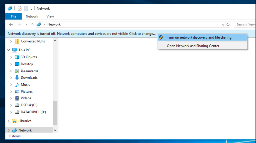

# Failų bendrinimas tinkle sistemoje "Windows 10"

**Pastaba:** jei anksčiau naudojote namų grupę failų bendrinimui, atkreipkite dėmesį, kad namų grupė buvo pašalinta iš "Windows 10" (1803 versija). Dabar galite bendrinti spausdintuvus ir failus naudodami įtaisytas "Windows 10" funkcijas.

**Failų arba aplankų bendrinimas tinkle**

- Failų **naršyklėje** pasirinkite failą, > spustelėkite  skirtuką Bendrinti, > dalyje Bendrinti **su** spustelėkite **Konkretūs žmonės.**

    
          
- Jei iš karto pasirinksite kelis failus, galėsite juos visus bendrinti taip pat. Jis taip pat tinka ir aplankams.

**Norėdami peržiūrėti įrenginius tinkle, kurie bendrina failus**

- Failų **naršyklėje** eikite į **Tinklas**. Jei tinklo aptikimas neįgalintas, matysite klaidos pranešimą "Tinklo aptikimas išjungtas..."

- Spustelėkite tinklo **aptikimą išjungta juosta,** tada spustelėkite Įjungti **tinklo aptikimą ir failų bendrinimą.**

    

[Skaitykite daugiau apie failų bendrinimą tinkle](https://support.microsoft.com/help/4092694/windows-10-file-sharing-over-a-network)

[Failų bendrinimas naudojant programėles, "OneDrive", el. laiškus ir kt.](https://support.microsoft.com/help/4027674/windows-10-share-files-in-file-explorer)
