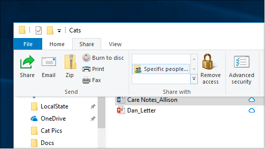

# Failų bendrinimas tinkle sistemoje "Windows 10"File sharing over a network in Windows 10

**Pastaba:** jei anksčiau naudojote namų grupę failų bendrinimui, atkreipkite dėmesį, kad namų grupė buvo pašalinta iš "Windows 10" (1803 versija).**Note**: If you previously used HomeGroup for file sharing, please note that HomeGroup has been removed from Windows 10 (Version 1803). Dabar galite bendrinti spausdintuvus ir failus naudodami įtaisytas "Windows 10" funkcijas.You can now share printers and files by using built-in features in Windows 10.

**Failų arba aplankų bendrinimas tinkle****To share files or folders over a network**

- Failų **naršyklėje** pasirinkite failą, > spustelėkite  skirtuką Bendrinti, > dalyje Bendrinti **su** spustelėkite **Konkretūs žmonės.**In **File Explorer**, select a file > click the **Share** tab at the top > in the **Share with** section, click **Specific people**.

    
          
- Jei iš karto pasirinksite kelis failus, galėsite juos visus bendrinti taip pat.If you select multiple files at once, you can share them all in the same way. Jis taip pat tinka ir aplankams.It works for folders, too.

**Norėdami peržiūrėti įrenginius tinkle, kurie bendrina failus****To see devices on the network that are sharing files**

- Failų **naršyklėje** eikite į **Tinklas**.In **File Explorer**, go to **Network**. Jei tinklo aptikimas neįgalintas, matysite klaidos pranešimą "Tinklo aptikimas išjungtas..."If Network discovery is not enabled, you will see an error message "Network discovery is turned off..."

- Spustelėkite tinklo **aptikimą išjungta juosta,** tada spustelėkite Įjungti **tinklo aptikimą ir failų bendrinimą.**Click the **Network discovery is turned off** banner, then click **Turn on network discovery and file sharing**.

    

[Skaitykite daugiau apie failų bendrinimą tinkleRead more about file sharing over a network](https://support.microsoft.com/help/4092694/windows-10-file-sharing-over-a-network)

[Failų bendrinimas naudojant programėles, "OneDrive", el. laiškus ir kt.Share files using apps, OneDrive, emails, and more](https://support.microsoft.com/help/4027674/windows-10-share-files-in-file-explorer)
