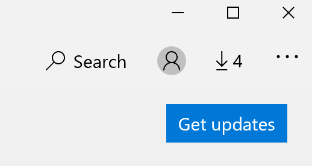

# Programų rodymo kalbos taisymas

Pakeitus rodymo kalbą sistemoje "Windows 10", kai kurios programėlės vis tiek gali naudoti ankstesnę kalbą, kai jas atidarote. Taip nutinka dėl to, kad naujas tos kalbos programėlių versijas reikia atsisiųsti iš parduotuvės. Norėdami išspręsti šią problemą, galite palaukti automatinio naujinimo arba rankiniu būdu įdiegti atnaujintą programėlių versiją.

Norėdami įdiegti naujinimą rankiniu būdu, atidarykite **"Microsoft Store"** ir viršutiniame dešiniajame kampe spustelėkite **Atsisiuntimai ir naujinimai.** Tada spustelėkite **Gauti naujinimus**. Jei baigus naujinti kalba nekeičiama, pabandykite iš naujo paleisti kompiuterį.

Norėdami daugiau sužinoti apie įvesties ir rodymo kalbos parametrus, žiūrėkite [Įvesties ir rodymo kalbos parametrų valdymas sistemoje "Windows 10".](https://support.microsoft.com/help/4027670/windows-10-add-and-switch-input-and-display-language-preferences)
