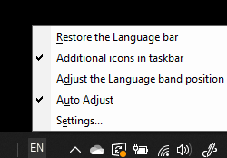

# Kalbos juostos slėpimas, rodymas arba nustatymas iš naujoHide, display, or reset the language bar

**Norėdami minimizuoti kalbos juostą:****To minimize the language bar:**

Viršutiniame dešiniajame kalbos juostos kampe galite spustelėti minimizuoti mygtuką.You can click the minimize button on the top right corner of the language bar. Arba galite tiesiog nuvilkti kalbos juostą į užduočių juostą, kuri automatiškai ją minimizuoja.Or, you can just drag the language bar to the task bar, which will automatically minimize it.

**Norėdami iššokanti kalbos juostą:****To pop out the language bar:**

Jei užduočių juostoje nenorite prijungti kalbos juostos, dešiniuoju pelės mygtuku spustelėkite tuščią vietą  užduočių juostoje ir panaikinkite meniu Įrankių juostos parinkties Kalbos juosta žymėjimą.If you don't want to dock the language bar in the taskbar, right-click any empty space in the taskbar, and uncheck the **Language bar** option in the Toolbars menu. Taip kalbos juosta bus rodoma ne užduočių juostoje, kaip ir ankstesnėje ekrano kopijoje.This will make the language bar appear outside the taskbar, just like the previous screenshot.

**Norėdami atkurti numatytąją kalbos juostą:****To restore the language bar to default:**

Dešiniuoju pelės mygtuku įrankių juostoje spustelėkite kalbos mygtuką, tada meniu **spustelėkite Atkurti** kalbos juostos parinktį.Right-click the language button in the toolbar, and click **Restore the language bar** option in the menu. Taip bus atkurtas numatytasis parametras.This will restore it to default.

