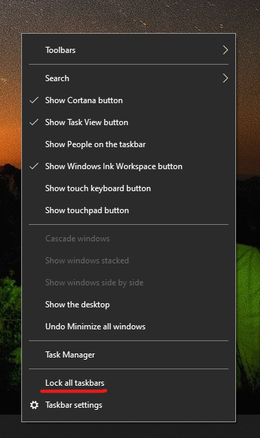

# Užduočių juostos perkėlimas į bet kurią darbalaukio pusę arba viršųMove the taskbar to either side or the top of your desktop

Pirmiausia patvirtinkite, kad užduočių juosta atrakinta.First, please confirm that the taskbar is unlocked. Norėdami sužinoti, ar jūsų yra atrakinta, dešiniuoju pelės mygtuku  spustelėkite tuščią vietą užduočių juostoje ir patikrinkite, ar šalia užduočių juostos yra varnelė.To find out whether yours is unlocked, right-click any empty space on the taskbar and see whether **Lock the taskbar** has a checkmark next to it. Jei yra varnelė, užduočių juosta užrakinta ir jos perkelti negalima.If there is a checkmark, the taskbar is locked and cannot be moved. Spustelėjus **Užrakinti užduočių juostą** vieną kartą, ji bus atrakinta ir pašalinti varnelė.Clicking **Lock the taskbar** once will unlock it and remove the checkmark.

Jei turite kelis monitorius, kurie rodo užduočių juostą, matysite **Užrakinti visas užduočių juostas**.If you have multiple monitors that display the taskbar, you will see **Lock all taskbars**.

Kai užduočių juosta bus atrakinta, galite paspausti ir laikyti tuščią vietą užduočių juostoje ir nuvilkite ją į norimą vietą ekrane.Once the taskbar is unlocked, you can press and hold any empty space on the taskbar and drag it to the location you want on the screen. Taip pat galite tai padaryti dešiniuoju pelės mygtuku spustelėdami bet kurią tuščią vietą užduočių juostoje ir eikite į ** Užduočių juostos > užduočių juostos vietą ekrane**.You can also do so by right-clicking on any empty space on the taskbar and go to **[Taskbar settings](ms-settings:taskbar?activationSource=GetHelp) > Taskbar location on screen**.
