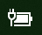

# Maitinimo arba akumuliatoriaus piktogramos nėra Windows 10

Jei jūsų "Windows 10" įrenginyje yra akumuliatorius (pvz., nešiojamasis kompiuteris arba planšetinis kompiuteris arba kompiuteris, prijungtas per USB prie UPS), paprastai šalia laikrodžio užduočių juostoje rodoma maitinimo / akumuliatoriaus piktograma, pvz.:

Jei nematote šios piktogramos, ji gali būti paslėpta:

1. Eikite **[į Parametrai > personalizavimo > užduočių juostą.](ms-settings:taskbar?activationSource=GetHelp)**

2. Srityje Pranešimai spustelėkite Pasirinkti, **kurios piktogramos rodomos užduočių juostoje.**

3. Tada sąraše **raskite "Power"** elementą ir perjunkite jo parametrą į **Įjungti**.

    

**Trikčių diagnostika**

Jei vadovavote anksčiau pateiktoms instrukcijoms ir **"Power"** perjungimas yra pilkas arba nematomas,  užduočių juostos ieškos lauke įveskite **įrenginių** tvarkytuvė , tada rezultatų sąraše pasirinkite Įrenginių tvarkytuvė. Dalyje **Akumuliatoriai** dešiniuoju pelės mygtuku spustelėkite įrenginio akumuliatorių, spustelėkite **Išjungti**, tada spustelėkite **Taip**. Palaukite kelias sekundes, tada dešiniuoju pelės mygtuku spustelėkite akumuliatorių ir spustelėkite **Įgalinti**. Tada iš naujo paleiskite įrenginį.

Jei ėjote anksčiau pateiktas instrukcijas, bet akumuliatoriaus piktograma nerodoma užduočių juostoje, užduočių juostos  ieškos lauke įveskite **Užduočių** tvarkytuvas , tada rezultatų sąraše spustelėkite Užduočių tvarkytuvas. Skirtuko Procesai **dalyje** Pavadinimas dešiniuoju **pelės** mygtuku spustelėkite Naršyklė **,** tada spustelėkite Paleisti iš **naujo.**
