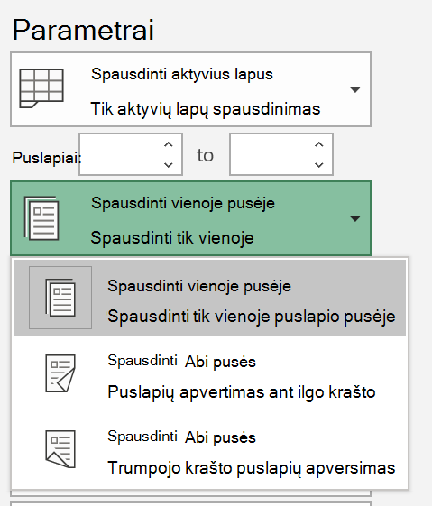
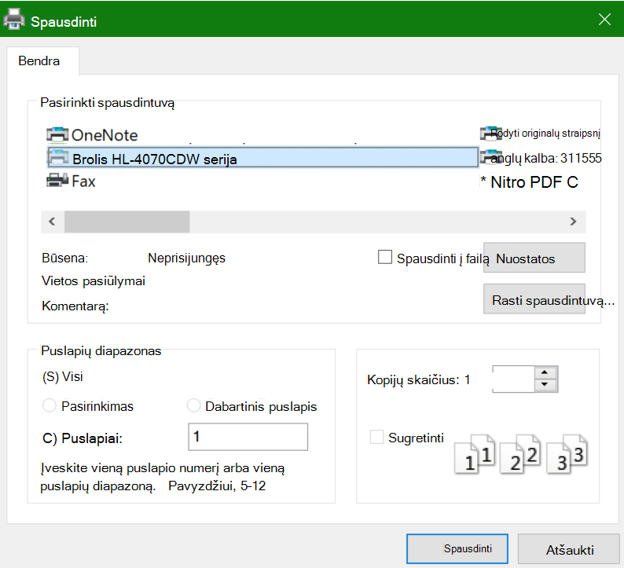

# Spausdinimas ant abiejų popieriaus lapo pusių (dvipusis spausdinimas)Printing on both sides of paper (duplex printing)

**Ar spausdintuvas gali spausdinti ant abiejų pusių?****Is my printer capable of duplex printing?**

Jūsų spausdintuvo funkcijų suvestinė arba vadovas turi nurodyti, ar ji gali spausdinti ant abiejų popieriaus lapo pusių, dar vadinamą dvipusį spausdinimą.Your printer’s feature summary or manual should tell you whether it is capable of printing on both sides of the paper, also known as “duplex printing.” Jei turite "Microsoft Office", dar vieną būdą sužinoti galite atidarę "Office" programą, pvz., "Word" arba "Excel", eikite į **failas > spausdinti**, įsitikinkite, kad pasirinktas tinkamas spausdintuvas ir ieškote funkcijos dalyje Parametrai.If you have Microsoft Office, another way to find out is by opening an Office app like Word or Excel, going to **File > Print**, making sure the right printer is selected, and looking for the capability in the Settings section. Pavyzdžiui:For example: 

**Dvipusis spausdinimas "Microsoft Office"****Duplex printing in Microsoft Office**

Jei spausdintuvas gali spausdinti abiejose pusėse, kai einate į **failą > spausdinti** "Office" programoje, matysite parinktį "spausdinti abiejose pusėse", kaip parodyta aukščiau pateiktame pavyzdyje.If your printer is capable of printing on both sides, when you go to **File > Print** in the Office app, you will see an option to “Print on Both Sides,” as shown in the example above.  Pasirinkite norimą dvipusio spausdinimo tipą (pasukimas ilgu kraštu arba apverskite trumpojo krašto) ir spustelėkite **Spausdinti** , kad pradėtumėte spaudinį.Select the type of duplex printing you want (flip on long edge, or flip on short edge), and click **Print** to start the printout.

**Dvipusio spausdinimo iš bet kurios taikomosios programos****Duplex printing from any application**

Daugelyje taikomųjų programų spausdinant matysite bendrą spausdinimo dialogo langą, panašų į šį:In many apps when you print you will see a general print dialog that looks like this: 

Įsitikinkite, kad pažymėjote tinkamą spausdintuvą, tada spustelėkite **nuostatos** , kad atidarytumėte langą spausdintuvo nuostatos.Make sure the right printer is selected, then click **Preferences** to open the printer preferences window. Jei spausdintuvas gali atlikti dvipusį spausdinimą, Šiame lange bus rodoma galimybė įgalinti esamą spausdinimo užduotį.If the printer is capable of duplex printing, the ability to enable this for the current print job will show in that window.
