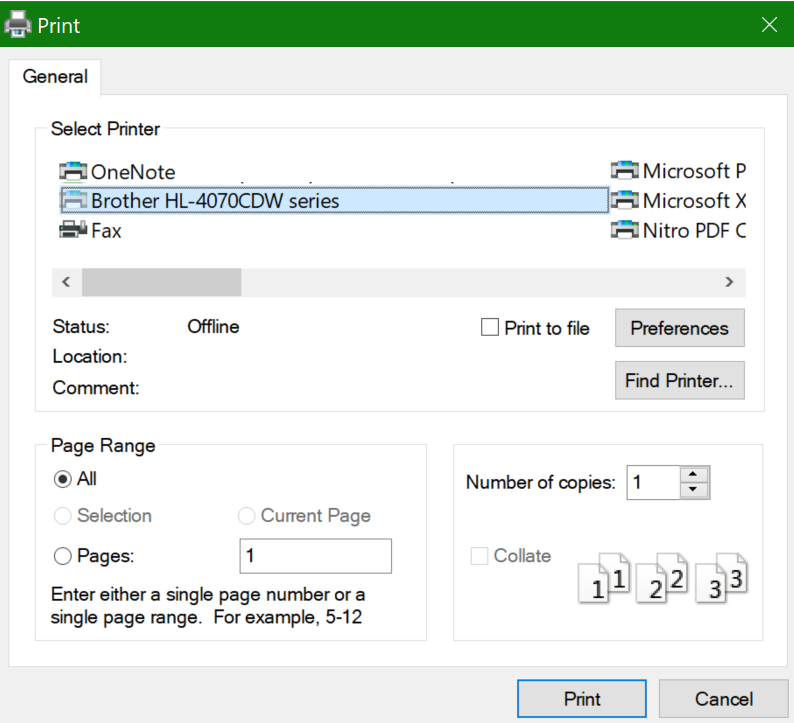

# Spausdinimas ant abiejų popieriaus pusių (dvipusis spausdinimas)

**Ar mano spausdintuvas gali spausdinti dvipusiu spausdinimu?**

Jūsų spausdintuvo funkcijų suvestinė arba neautomatinis turėtų nurodyti, ar galima spausdinti ant abiejų popieriaus pusių, dar vadinamų dvipusio spausdinimo funkcija. Jei turite "Microsoft Office", kitas būdas sužinoti yra atidaryti ""Office" programa", pvz., "Word" arba "Excel", eiti į **Failas > Spausdinti**, įsitikinkite, kad pasirinktas tinkamas spausdintuvas ir ieškoma galimybių Parametrai dalyje. Toliau pateikiami pavyzdžiai. 

**Dvipusis spausdinimas Microsoft Office**

Jei spausdintuvas gali spausdinti abiejose pusėse, kai **""Office" programa"** eikite į Failas > Spausdinti, matysite parinktį "Spausdinti abiejose pusėse", kaip parodyta aukščiau pateiktame pavyzdyje.  Pasirinkite norimą dvipusio spausdinimo tipą (apverskite ant ilgo krašto arba apverskite trumpą kraštą) ir spustelėkite **Spausdinti,** kad pradėtumėte spausdinti.

**Dvipusis spausdinimas iš bet kurios taikomosios programos**

Daugelyje programų, kai spausdinate, matysite bendrą spausdinimo dialogo langą, kuris atrodo taip: 

Įsitikinkite, kad pasirinktas tinkamas spausdintuvas, tada **spustelėkite** Nuostatos, kad atidarytumėte spausdintuvo nuostatų langą. Jei spausdintuvas gali spausdinti dvipusį spausdinimą, šiame lange bus rodoma galimybė įgalinti šią spausdinimo užduotį.
