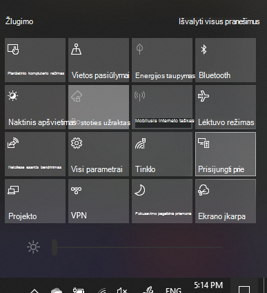

# "Project" į kompiuterįProject to a PC

Paskirties įrenginyje (projekcija į) ieškokite "Projekcijos parametrai", kad atidarytumėte parametrų puslapį **Projektavimas šiame kompiuteryje.**On your destination device (projecting to), search for "Projection Settings" to open the Settings page of **Projecting to this PC**. Tada įsitikinkite, kad:Then make sure that:
- "Kai kurie "Windows" ir "Android" įrenginiai gali projektuoti šiame kompiuteryje, kai sakote, kad tai gerai" išplečiamasis meniu nustatytas kaip **Visada išjungtas**."Some Windows and Android devices can project to this PC when you say it's OK" drop-down menu is set to **Always Off**.
- Išplečiamasis meniu "Prašyti projekto šiame kompiuteryje" nustatytas kaip **Kaskart, kai reikalingas ryšys.**"Ask to project to this PC" drop-down menu is set to **Every time a connection is required**.
- Išplečiamasis meniu "Reikalauti PIN susiejimui" nustatytas kaip **Niekada**."Require PIN for pairing" drop-down menu is set to **Never**.

Paskirties įrenginyje paleiskite Prisijungimo **programa** nueidami į **Pradžia** ir ieškokite "Prisijungti".On your destination device, launch **Connect** app by going to **Start** and search for "Connect".

Tada šaltinio įrenginyje, iš kurį bandote projektuoti:Then, on your source device that you are trying to project from:

1. Paspauskite **"Windows" klavišą + A,** kad atidarytumėte veiksmų centrą.Press **Windows key + A** to open Action Center.
2. Spustelėkite **Prisijungti**.Click **Connect**.
3. Spustelėkite įrenginį, kuriame norite rodyti ekraną.Click the device you want to project the screen to.

Atlikus anksčiau nurodytus veiksmus, jūsų paskirties įrenginys turėtų rodyti šaltinio įrenginio ekraną taip, tarsi jis būtų antrinis monitorius.After the above steps, your destination device should display the screen of the source device as if it is a secondary monitor.
