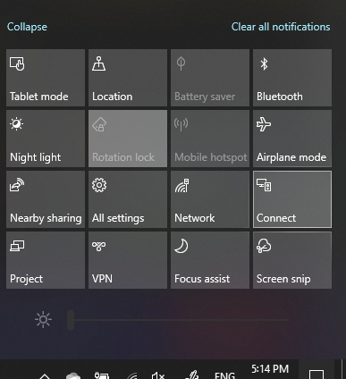

# Project į kompiuterį

Paskirties įrenginyje (projekcija į) ieškokite "Projection Parametrai", kad atidarytumėte Parametrai puslapį **Projektavimas šiame kompiuteryje.** Tada įsitikinkite, kad:
- "Kai Windows "Android" įrenginiai gali projektuoti į šį kompiuterį, kai sakote, kad tai gerai" išplečiamasis meniu nustatytas kaip **Visada išjungtas**.
- Išplečiamasis meniu "Prašyti projekto šiame kompiuteryje" nustatytas kaip **Kaskart, kai reikalingas ryšys.**
- Išplečiamasis meniu "Reikalauti PIN susiejimui" nustatytas kaip **Niekada**.

Paskirties įrenginyje paleiskite **"Prisijungimas"** nueikite į **Pradžia** ir ieškokite "Prisijungimas".

Tada šaltinio įrenginyje, iš kurį bandote projektuoti:

1. Paspauskite **Windows + A, kad** atidarytumėte veiksmų centrą.
2. Spustelėkite **Prisijungimas**.
3. Spustelėkite įrenginį, kuriame norite rodyti ekraną.

Atlikus anksčiau nurodytus veiksmus, jūsų paskirties įrenginys turėtų rodyti šaltinio įrenginio ekraną taip, tarsi jis būtų antrinis monitorius.
