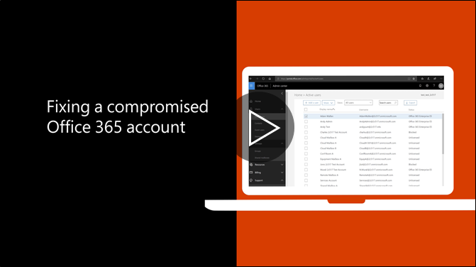

# Rekomenduojamus veiksmus reikia atlikti, jei paskyra būtų pažeista

  
1. [Iš naujo nustatyti vartotojo slaptažodį](https://support.office.com/article/7a5d073b-7fae-4aa5-8f96-9ecd041aba9c) iš karto. Perduoti galutiniam vartotojui ne naują slaptažodį elektroniniu paštu. 
    
2. Pašalinti visus įtartinus [peradresavimo adresai](https://support.office.com/article/ab5eb117-0f22-4fa7-a662-3a6bdb0add74) pašto dėžutės dydžio. 
    
3. Pašalinti visus įtartinus [aplanko Gauta taisykles](https://support.office.com/article/1433E3A0-7FB0-4999-B536-50E05CB67FED) per pašto dėžutę. 
    
4. Jei vartotojas yra blokuojamas siunčiant elektroniniu paštu, [eikite į ribotų teisių vartotojai Norėdami atblokuoti paskyrą](https://protection.office.com/?hash=/restrictedusers). Kai daroma, vartotojas turėtų galėti tęsti laiškų siuntimas per 1 valandą.
    
5. Pašalinti vartotojo abonementą iš jokių [administravimo vaidmenų grupės](https://support.office.com/article/eac4d046-1afd-4f1a-85fc-8219c79e1504) tol, kol jūs esate tikri, kad sąskaita yra jau pažeista. 
    
Siekiant sumažinti duomenų pažeidimą ar sugadintos paskyros ateityje, rekomenduojame perskaityti mūsų ["Office 365" sauga geriausios praktikos straipsnis](https://support.office.com/article/9295e396-e53d-49b9-ae9b-0b5828cdedc3).
  

