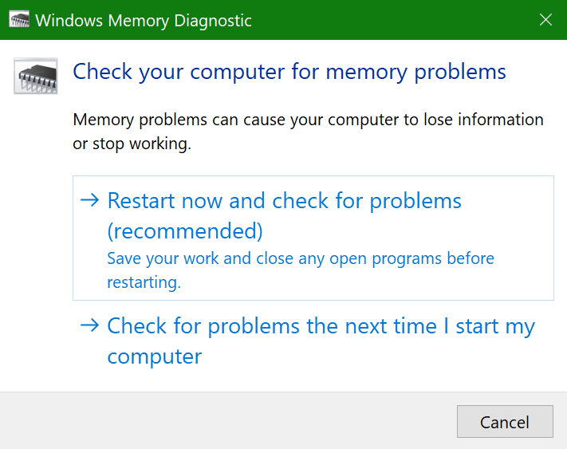
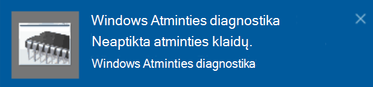

# "Windows" atminties diagnostikos paleidimas sistemoje "Windows 10"

Jei "Windows" ir kompiuterio programėlės sugenda, užstringa arba veikia nestabiliai, gali kilti kompiuterio atminties (RAM) problemų. Galite paleisti "Windows" atminties diagnostiką, kad patikrinsite kompiuterio RAM problemas.

Užduočių juostos ieškos lauke įveskite atminties **diagnostika**, tada pasirinkite **"Windows" atminties diagnostika**. 

Norėdami vykdyti diagnostiką, kompiuteris turi būti paleistas iš naujo. Turite galimybę iš naujo paleisti iš karto (pirmiausia įrašykite savo darbą ir uždarykite atidarytus dokumentus ir el. laiškus) arba suplanuoti diagnostiką, kad ji būtų vykdoma automatiškai, kai kompiuteris bus paleistas iš naujo:

Kai kompiuteris bus paleistas iš naujo, **"Windows" atminties diagnostikos įrankis** bus paleistas automatiškai. Būsena ir eiga bus rodomi kaip diagnostika, o jūs turite galimybę atšaukti diagnostiką paspaudus **klaviatūros klavišą ESC.**

Kai diagnostika bus baigta, "Windows" pradės įprastai.
Iš karto po paleidimo iš naujo, kai rodomas  darbalaukis, bus rodomas pranešimas (užduočių juostoje šalia veiksmų centro piktogramos), nurodantis, ar rasta atminties klaidų. Toliau pateikiami pavyzdžiai.

Štai veiksmų centro piktograma:  

Ir pranešimo pavyzdys: 

Jei praleidote pranešimą, užduočių juostoje galite pasirinkti veiksmų centro piktogramą, kad būtų rodomas veiksmų **centras** ir rodomas slenkamas pranešimų sąrašas. 

Norėdami peržiūrėti išsamią informaciją, **įveskite įvykį** užduočių juostos ieškos lauke, tada pasirinkite Įvykių **peržiūros programa**. Įvykių **peržiūros programos kairiojoje** srityje eikite į **"Windows" žurnalai > Sistema**. Dešiniosios srities srityje nuskaitykite sąrašą žiūrėdami į stulpelį Šaltinis, kol pamatysite įvykius su šaltinio reikšme **MemoryDiagnostics-Results**.  Pažymėkite kiekvieną tokį įvykį ir peržiūrėkite rezultato informaciją lauke **po skirtuku Bendra** po sąrašu.
