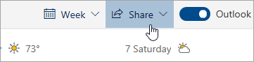

# Bendrinimas su "Outlook" žiniatinklyje

Kalendoriaus puslapio viršuje esančioje įrankių juostoje pasirinkite **Bendrinti**ir pasirinkite kalendorių, kurį norite bendrinti.

    

**Pastaba:** negalite bendrinti kalendorių, priklausančių kitiems žmonėms.

- Įveskite asmens, su kuriuo norite bendrinti kalendorių, vardą arba el. pašto adresą.
- Pasirinkite, kaip asmuo turėtų naudoti jūsų kalendorių:
    - **Gali peržiūrėti, kai esu užsiėmęs**   leidžia jiems matyti, kada esate užsiėmę, bet neapima išsamios informacijos, pvz., įvykio vietos.
    - **Gali peržiūrėti pavadinimus ir vietas**   leidžia jiems matyti, kada esate užsiėmę, taip pat įvykių pavadinimą ir vietą.
    - **Gali peržiūrėti visą informaciją**   leidžia jiems pamatyti visą informaciją apie savo įvykius.
    - **Galima redaguoti**   leidžia jiems redaguoti kalendorių.
    - **Atstovas**   leidžia jiems redaguoti kalendorių ir bendrinti jį su kitais.
- Pasirinkite **Bendrinti**.
