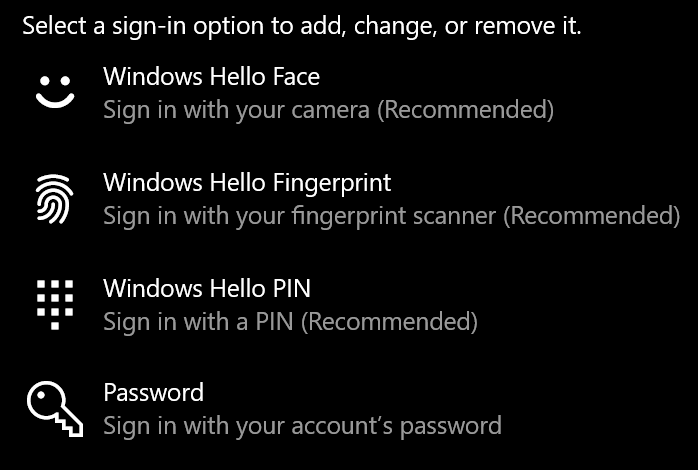
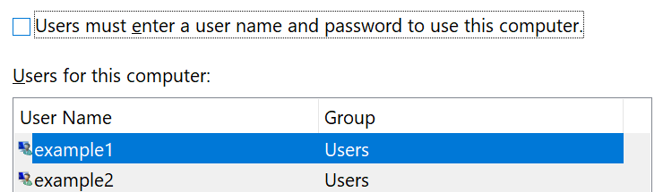

# Prisijungimas prie "Windows 10" nenaudojant slaptažodžio

Kad nereikėtų įvesti slaptažodžio "Windows" paleisties metu, rekomenduojame naudoti vieną iš "Windows Hello" saugaus prisijungimo parinkčių, pvz., PIN, veido atpažinimo arba pirštų atspaudų, jei yra. Jei tikrai norite išjungti saugią prisijungimo funkciją, peržiūrėkite toliau pateiktas instrukcijas "automatiškai prisijungti prie" Windows 10 ".

**Apsaugokite "Windows Hello" į paskyros slaptažodį**

Eikite į **parametrai > paskyros > prisijungimo parinktys** (arba spustelėkite [čia](ms-settings:signinoptions?activationSource=GetHelp)). Bus įtrauktos galimos prisijungimo parinktys. Pavyzdžiui:

Spustelėkite arba bakstelėkite vieną iš parinkčių, kad ją sukonfigūruotumėte. Kai tik pradėsite arba atrakinsite "Windows", galėsite naudoti naują parinktį vietoj slaptažodžio. 

**Automatinis prisijungimas prie "Windows 10"**

**Pastaba**: Automatinis prisijungimas yra patogus, tačiau įveda saugos pavojų, ypač, jei jūsų kompiuterį gali naudoti keli žmonės. 

1. Spustelėkite arba bakstelėkite mygtuką **pradėti** užduočių juostoje.

2. Įveskite **netplwiz** ir paspauskite klavišą "įvesti", kad atidarytumėte langą vartotojų abonementai.

3. **Vartotojų abonementuose**spustelėkite abonementą, kurį norite automatiškai prisijungti, kai "Windows" pradės.

4. Atžymėkite žymimąjį langelį "vartotojai turi įvesti vartotojo vardą ir slaptažodį, kad galėtų naudoti šį kompiuterį".

    

5. Spustelėkite **Gerai**. Jūsų bus paprašyta įvesti ir patvirtinti pasirinkto abonemento slaptažodį. Spustelėkite **gerai** , kad pabaigtumėte. Paleidus "Windows 10", jis automatiškai prisijungs prie pasirinktos paskyros.
