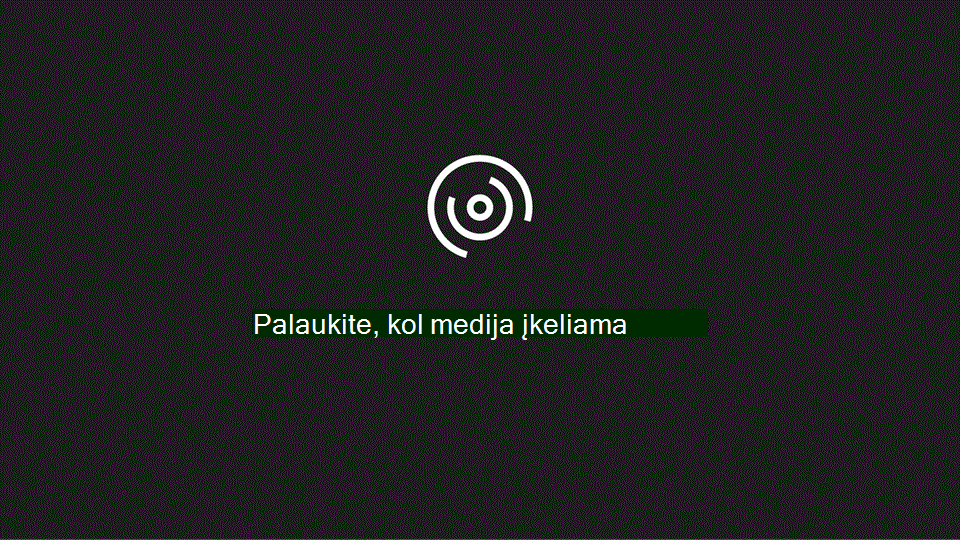

# Domeno ir vartotojų nustatymasSet up domain and users

Kai būsite pasirengę nustatyti domeną ir naudotojus, peržiūrėkite šį spartųjį vaizdo įrašą:When you're ready to set up your domain and users, watch this quick video:
  

  
Jei norite gauti daugiau informacijos, peržiūrėkite [domenų DUK.](https://docs.microsoft.com/microsoft-365/admin/setup/domains-faq)For more information, see the [Domains FAQ.](https://docs.microsoft.com/microsoft-365/admin/setup/domains-faq)