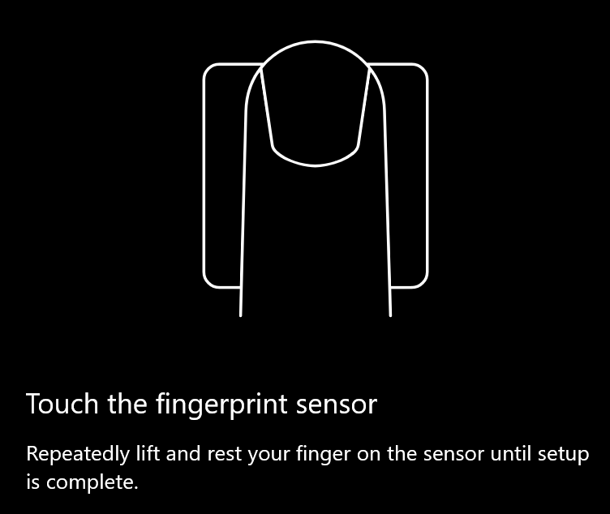
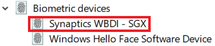

# Pirštų atspaudų atrakinimo parinkties naudojimas sistemoje "Windows 10"

**"Windows Hello" piršto atspaudo įgalinimas**

Jei norite atrakinti "Windows 10" naudodami pirštų atspaudus, turite nustatyti "Windows Hello" pirštų atspaudus, įtraukdami ("Windows" išmokę atpažinti) bent vieną pirštą. 

1. Eikite į **parametrai > paskyros > prisijungimo parinktys** (arba spustelėkite [čia](ms-settings:signinoptions?activationSource=GetHelp)). Bus įtrauktos galimos prisijungimo parinktys. Pavyzdžiui:

    

2. Spustelėkite arba bakstelėkite **"Windows Hello" piršto atspaudas**, tada spustelėkite **nustatyti**. "Windows Hello" sąrankos **lange spustelėkite pradėti**. Pirštų atspaudų jutiklis suaktyvinamas ir būsite paraginti įdėti pirštą ant jutiklio:

   

3. Vykdykite nurodymus, kurie paprašys pakartotinai nuskaityti pirštą. Kai tai bus baigta, turėsite galimybę įtraukti kitų pirštų, kuriuos galbūt norėsite naudoti prisijungdami. Kai prisijungsite prie "Windows 10", turėsite galimybę naudoti pirštų atspaudus.

**"Windows Hello" piršto atspaudas negalimas kaip prisijungimo parinktis**

Jei "Windows Hello" kontrolinis kodas nerodomas kaip parinktis **prisijungimo parinktyse**, vadinasi, "Windows" nežino apie bet kokį pirštų atspaudų skaitytuvą/skaitytuvą, prijungtą prie jūsų kompiuterio, arba kad sistemos strategija neleidžia jos naudoti (pvz., jūsų kompiuterį tvarko jūsų darbo vieta). Norėdami pašalinti triktis: 

1. Pasirinkite mygtuką **Pradžia** užduočių juostoje ir ieškokite **įrenginių tvarkytuvė**.

2. Spustelėkite arba bakstelėkite, kad atidarytumėte **įrenginių tvarkytuvę**.

3. Įrenginių tvarkytuvėje išplėskite biometrinius įrenginius spustelėdami jo ševroną.

   

4. Jūsų pirštų atspaudų skaitytuvas turi būti pateiktas kaip biometrinis įrenginys, pvz., "Synaptics WBDI" skaitytuvas:

   

5. Jei jūsų pirštų atspaudų skaitytuvas nerodomas ir skaitytuvas integruotas į jūsų kompiuterį, eikite į kompiuterio gamintojo svetainę. KOMPIUTERIO modelio techninio palaikymo sekcijoje ieškokite "Windows 10" tvarkyklės, skirtos skaitytuvui, kurį galite įdiegti.

6. Jei skaitytuvas yra atskirtas nuo asmeninio kompiuterio (pridėto per USB), eikite į skaitytuvo gamintojo svetainę ir raskite bei įdiekite "Windows 10" įrenginio tvarkyklės programinę įrangą, skirtą skaitytuvo modeliui.
