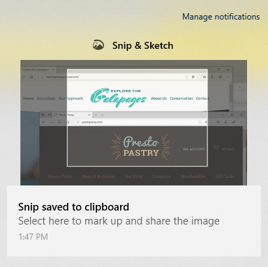

# Iškarpų & eskizų naudojimas vaizdams fiksuoti, žymėti ir bendrinti

Ekrano eskizas dabar vadinamas **iškarpų & eskizu.** **Norėdami greitai iškarpą paimti:**

1. Paspauskite **Windows klavišas + Shift + S**. Matysite ekraną patamsėti ir žymiklis bus rodomas kaip kryželiu. 

2. Pasirinkite tašką norimos kopijuoti srities krašte ir kairiuoju pelės mygtuku spustelėkite žymiklį. 

3. Perkelkite žymiklį, kad pažymėtumėte sritį, kurią norite užfiksuoti. Užfiksuotas plotas bus rodomas ekrane.

   

Iškarpytas vaizdas įrašomas į mainų sritį, paruoštas įklijuoti į el. laišką arba dokumentą. 

**Jei norite redaguoti arba peržiūrėti vaizdą:** 

- Spustelėkite pranešimų piktogramą užduočių juostos dešinėje pusėje; tada spustelėkite ką tik užfiksuotame paveikslėlyje. Jūsų iškarpa atidaroma programoje Iškarpa & Sketch".

   
