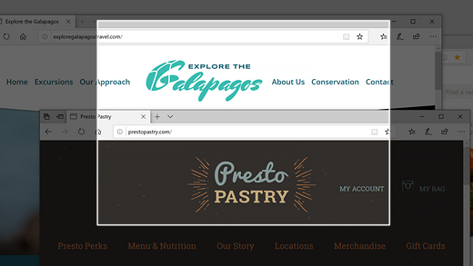

# Iškarpų & eskizas naudojimas vaizdams fiksuoti, žymėti ir bendrintiUse Snip & Sketch to capture, mark up, and share images

Ekrano eskizas dabar vadinamas **įkarpa & eskizas**.Screen sketch is now called **Snip & Sketch**. **Norėdami greitai paimti įkarpą:****To quickly take a snip**:

1. Paspauskite **"Windows" logotipo klavišą + Shift + S**. Ekranas patamsės, o žymeklis bus rodomas kaip kryžius.Press the **Windows logo key + Shift + S**. You'll see your screen darken and your cursor displayed as a cross. 

2. Pasirinkite tašką norimos kopijuoti srities krašte ir kairėje spustelėkite žymiklį.Choose a point at the edge of the area you want to copy and left-click the cursor. 

3. Perkelkite žymeklį, kad paryškintumėte sritį, kurią norite įrašyti.Move your cursor to highlight the area you want to capture. Ekrane bus rodoma fiksuojamas plotas.The area you capture will appear on your screen.

   

Vaizdas, kurį nušlažote, įrašomas į mainų sritį, paruoštas įklijuoti į el. laišką arba dokumentą.The image you snipped is saved to your clipboard, ready for pasting into an email or document. 

**Jei norite redaguoti arba per3/4iþrìti atvaizd±:****If you want to edit or view the image**: 

- Spustelėkite pranešimų piktogramą dešinėje užduočių juostos pusėje; tada spustelėkite nuotrauką, kurią ką tik užfiksavote.Click the notifications icon at the far right side of the taskbar; then click the picture you have just captured. Įkarpa atidaroma programoje "Įkarpa & eskizą".Your snip opens in the Snip & Sketch app.

   
