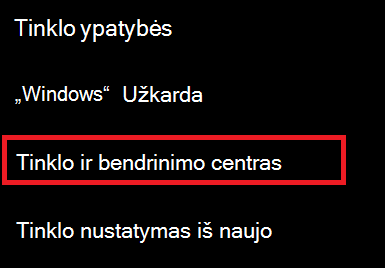
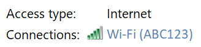
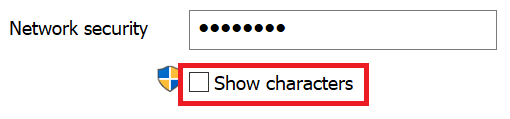

# Peržiūrėti Wi-Fi slaptažodį sistemoje "Windows 10"

1. Įsitikinkite, kad "Windows 10" kompiuteris prijungtas prie Wi-Fi tinklo.

2. Eikite **į Parametrai > Tinklo & " > Būsena**" arba  spustelėkite arba bakstelėkite čia, kad leiskime jums ten dabar.)

3. Spustelėkite **Tinklo ir bendrinimo centras**.

    

4. Tinklo **ir bendrinimo centre** šalia **Ryšiai** matysite belaidžio tinklo pavadinimą. Pavyzdžiui, jei jūsų tinklas pavadintas "ABC123", galite matyti:

    

    Spustelėkite belaidžio tinklo pavadinimą, kad atidarytumėte langą Wi-Fi būsena. 

5. Lange Wi-Fi būsena spustelėkite **Belaidžio ryšio ypatybės**, spustelėkite **skirtuką** Sauga ir pažymėkite Rodyti **simbolius**.

    

